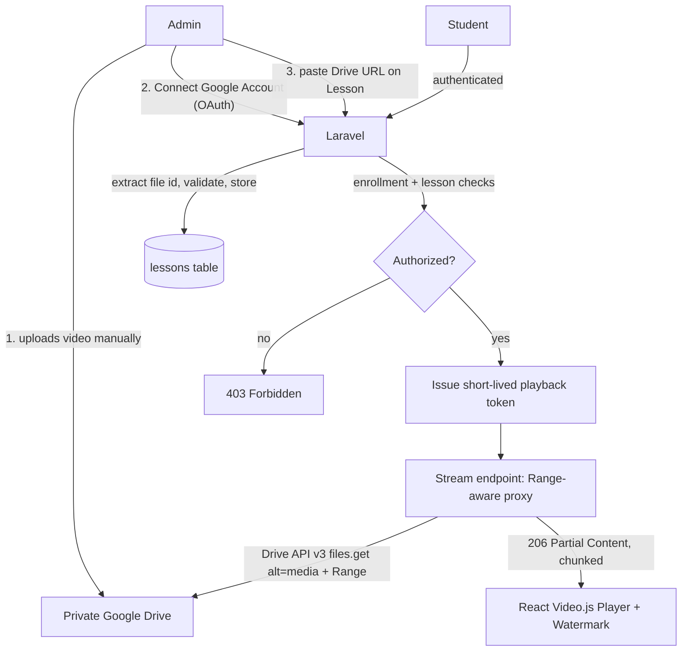
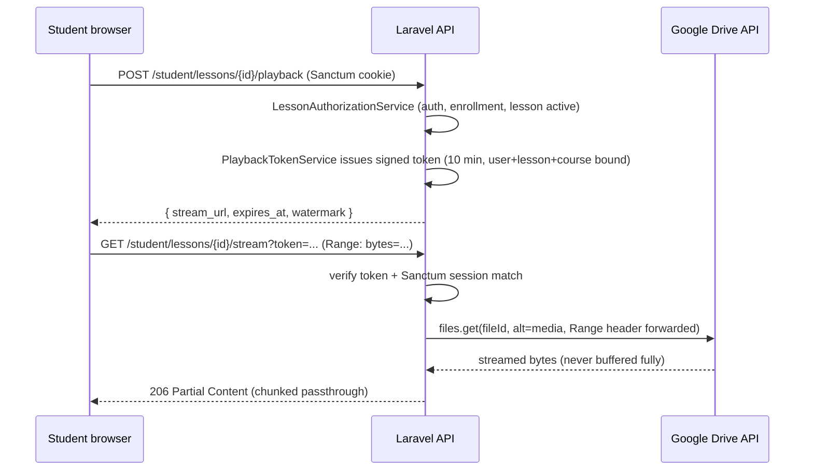

# Secure Google Drive Video Playback — T-Square LMS

## Audit summary (already completed, no code changed)

- Backend: Laravel 13, PHP 8.3, Sanctum 4 (cookie-session SPA + bearer fallback), Spatie roles, Pest 4 tests, service-layer architecture (`app/Services/**`), no policies actually enforced today, no rate limiting on course/video routes, no Google package installed.
- **Critical finding:** there is no `Lesson`/`Section` model. Course content today = `CoursePreview` (`app/Models/CoursePreview.php`, `course_previews` table) which is **public marketing content** shown to non-enrolled visitors, plus a single `courses.google_drive_link` opened in a new tab for enrolled students (`app/Http/Resources/User/Courses/CourseDashboardResource.php:33`, `CourseDetails.jsx:106-108`).
- Per your decision: build a **fully independent `lessons` table** (`Course hasMany Lesson`, flat — no `Section` table), leaving `course_previews` and `courses.google_drive_link` completely untouched (backward compatible).
- Frontend: React 19 + Vite, Bootstrap 5 + plain CSS, Axios with Sanctum cookie/CSRF (`src/api/axios.js`, `src/api/csrf.js`), no video library installed. Per your decision: add **Video.js**.
- Infra: production runs behind aaPanel-managed Nginx → PHP (no nginx.conf in this repo, only `deploy/nginx-security-headers.conf` snippet). Cannot edit the live Nginx config directly; will document exact directives for you to apply via aaPanel, same pattern already used for the Reverb WebSocket proxy in `SETUP_CHECKLIST.md`.

## Target architecture

## Phase 2 — Database

New migrations (Laravel 13 style, in `database/migrations/`):

- `create_google_storage_accounts_table`: `id, name, email nullable, access_token text nullable, refresh_token text nullable, token_expires_at nullable, scope nullable, status default 'pending', last_checked_at nullable, last_error nullable, connected_by (FK users, nullable, set null), timestamps, softDeletes`.
  - `access_token`/`refresh_token` cast as Laravel's built-in `'encrypted'` cast on the model (uses `APP_KEY`, no plaintext ever stored) — `app/Models/GoogleStorageAccount.php`, with `protected $hidden = ['access_token','refresh_token']`.
- `create_lessons_table`: `id, course_id (FK courses cascade), title, description nullable, sort_order default 0, is_active default true, video_source_type nullable, google_drive_file_id nullable, duration_seconds nullable, drive_validation_status nullable, drive_validation_message nullable, timestamps, softDeletes`. Index on `course_id`, `(course_id, sort_order)`.
- `add_google_storage_account_to_courses_table`: adds `google_storage_account_id` (FK, nullable, set null) and `google_drive_folder_id` (nullable string, organizational only, never required) to `courses`.

New models: `app/Models/Lesson.php` (`belongsTo Course`, `scopeActive`), `app/Models/GoogleStorageAccount.php` (`hasMany Course`). Update `app/Models/Course.php` (`Course.php:18-47`) to add the two new fillable fields and `lessons()` / `googleStorageAccount()` relations — `course_previews`/`google_drive_link` untouched.

## Phase 3 — Google OAuth

- `composer require google/apiclient` (official Google API PHP Client — no scraping, no HTML parsing).
- `config/services.php`: add `'google' => ['client_id' => env('GOOGLE_CLIENT_ID'), 'client_secret' => env('GOOGLE_CLIENT_SECRET'), 'redirect_uri' => env('GOOGLE_REDIRECT_URI')]` (matches the existing convention already used for postmark/resend/ses in this file).
- New `.env` vars only: `GOOGLE_CLIENT_ID`, `GOOGLE_CLIENT_SECRET`, `GOOGLE_REDIRECT_URI` — added to `.env.example` with empty values. No global access/refresh token in `.env`.
- `app/Services/Google/GoogleOAuthService.php`: builds the `Google\Client`, requests scope `https://www.googleapis.com/auth/drive.readonly` (+ `openid`, `email` to read the connected account's address), `access_type=offline`, `prompt=consent` (guarantees a refresh token), builds/consumes the auth URL, exchanges the code for tokens.
- `app/Services/Google/GoogleStorageAccountService.php`: `refreshAccessTokenIfNeeded($account)` — refreshes when `token_expires_at` is near/expired; catches `invalid_grant`/revoked-token errors, sets `status = disconnected`, logs `google_account_error` (no tokens in the log). `testConnection($account)` calls Drive `about->get()` to verify live access and updates `last_checked_at`/`status`.
- OAuth callback route requires `auth:sanctum` + `role:admin` (not public) — safe because the browser round-trips to Google and back in the *same* browser session; `SESSION_SAME_SITE=lax` (already set in `.env.example:73`) permits the session cookie on this top-level GET redirect, so the admin stays authenticated without any public/unauthenticated callback. A signed `state` param (encoding the initiating admin id + target account id) is also validated to prevent CSRF on the OAuth handshake. On completion, the controller 302-redirects back into the SPA (`FRONTEND_URL/admin/google-storage-accounts?connected=1|error=...`).

## Phase 4 — Admin: Google Storage Accounts

- `app/Http/Controllers/Api/Admin/GoogleStorageAccountController.php`: `index, store (name only, status=pending), connect (returns Google consent URL), callback, disconnect, testConnection, destroy` (blocked with 409 if courses are still linked).
- `app/Http/Resources/Admin/GoogleStorageAccountResource.php` — never serializes `access_token`/`refresh_token`.
- Routes added to `routes/admin.php` (inside the existing `auth:sanctum + role:admin` group, `admin.php:30-33`):
  - `GET/POST /admin/google-storage-accounts`, `PUT/DELETE /admin/google-storage-accounts/{account}`
  - `POST /admin/google-storage-accounts/{account}/connect`, `GET /admin/google-storage-accounts/callback`, `POST /admin/google-storage-accounts/{account}/disconnect`, `POST /admin/google-storage-accounts/{account}/test-connection`
- Frontend: new `src/modules/admin-dashboard/pages/GoogleStorageAccounts/GoogleStorageAccounts.jsx` following the existing `AdminCourses`/`AdminContentPage` list pattern — columns: Name, Email, Status, Courses Count, Last Connection Check, Actions (Connect/Reconnect/Disconnect/Test Connection) — never renders tokens. New route `/admin/google-storage-accounts` in `App.jsx`, new nav entry, `googleStorageAccountsService.js` + `useGoogleStorageAccounts.js` hook (mirrors `useAdminCourses.js`), toasts via existing `Toaster`, confirms via existing `ConfirmDialog`.

## Phase 5 — Course/Lesson: Google Drive URL input

- `app/Services/Google/GoogleDriveUrlParser.php` — pure regex-based, **no HTTP calls** (prevents SSRF): validates host is exactly `drive.google.com`/`docs.google.com` and extracts the file id from `/file/d/{id}/...`, `open?id=`, `uc?id=`, `uc?export=download&id=` forms; rejects everything else.
- `app/Http/Requests/Admin/LessonStoreRequest.php` / `LessonUpdateRequest.php`: `video_source_type in:none,google_drive`, `google_drive_url` (only required when `google_drive_url` present) validated through the parser; only the extracted `google_drive_file_id` is persisted — the raw URL is never stored.
- `app/Http/Controllers/Api/Admin/AdminLessonController.php` + `app/Services/Admin/AdminLessonService.php` (mirrors `AdminCourseService`) — CRUD nested under a course. On save, does a **metadata-only** Drive check (`files.get(fields: id,size,mimeType,trashed)`, never downloads content) best-effort; stores the result in `drive_validation_status`/`drive_validation_message` without blocking the save if the account is temporarily unavailable.
- Routes (mirroring the existing `{course:id}/previews/...` pattern in `admin.php:73-87`, since `Course` binds by slug): `GET/POST /admin/courses/{course:id}/lessons`, `PUT/DELETE /admin/courses/{course:id}/lessons/{lesson}`.
- `CourseStoreRequest`/`CourseUpdateRequest` gain optional `google_storage_account_id` (`exists:google_storage_accounts,id`) and `google_drive_folder_id`; `AdminCourseService` persists them.
- Frontend: new **"Lessons" tab** (`LessonsTab.jsx`) added alongside the existing Curriculum tab in `CourseForm` (kept separate on purpose — Curriculum stays 100% public/marketing) — per-lesson: title, description, order, active toggle, "Video Source: None / Google Drive" radio, Drive URL input with inline validation feedback. `SettingsTab.jsx` gets a "Google Storage Account" select + optional "Folder ID" field. New `lessonsService.js`.

## Phase 6 — Authorization

- `app/Services/Video/LessonAuthorizationService.php` replicates the exact enrollment/payment check already used in `CourseDashboardService` (`whereHas('enrollments', ... order.status === 'completed')`) plus: lesson belongs to the resolved course, `lesson.is_active`, course reachable via `Course::active()`. Returns `App\DTO\AuthorizationResult` (existing DTO, reused as-is from the exam-authorization pattern — `app/DTO/AuthorizationResult.php`).
- `app/Policies/LessonPolicy.php` (`view`) delegates to the service, following the same shape as the existing (currently-unused) `EnrollmentPolicy`; this time it's actually invoked via `$this->authorize()` in the controller.
- Any failed check → `403` with a safe, generic message (never file ids/Drive errors) and a `video_access_denied` log entry.

## Phase 7 — Secure Playback

- `app/Services/Video/PlaybackTokenService.php`: issues a short-lived (**10 minutes**), signed, encrypted opaque token (`Crypt::encryptString(json_encode([user_id, lesson_id, course_id, exp]))`) — stateless, no DB row needed, safe for the many Range requests a player makes against the same URL. `verify()` checks signature, expiry, and that `user_id/lesson_id/course_id` match the current request; throws dedicated `InvalidPlaybackTokenException` / `ExpiredPlaybackTokenException`.
- `app/Services/Google/GoogleDriveStreamingService.php`: caches file metadata (`size`, `mimeType`) for ~5 minutes (`Cache::remember`), forwards the client's `Range` header to Google Drive's `files.get(alt=media)` (Drive API supports `Range` natively), and exposes the resulting Guzzle stream in ~1MB chunks for a Symfony `StreamedResponse` — **at no point is the full file read into PHP memory** (no `file_get_contents`, no `Http::get()->body()`).
- `app/Http/Controllers/Api/User/LessonPlaybackController.php`:
  - `POST /student/lessons/{lesson}/playback` — `auth:sanctum, verified, role:student`, throttle `video-play` (30/min per user) → runs `LessonPolicy`, issues token, logs `video_play_authorized`, returns `{ stream_url, expires_at, watermark: { name, student_number } }`. **Never** returns a `drive.google.com` URL, `webContentLink`, or any Google token.
  - `GET /student/lessons/{lesson}/stream` — `auth:sanctum, verified, role:student`, throttle `video-stream` (generous, e.g. 600/min per user, sized for seek/Range bursts) → verifies token, refreshes the account's Google token if needed (`google_token_refresh`/`google_account_error` logs, no secrets logged), streams `206 Partial Content` with `Content-Range`, `Accept-Ranges`, `Content-Length`, `Content-Type`, `Content-Disposition: inline`, `X-Download-Options: noopen` (same anti-IDM header already used for certificates in `CertificateService.php:53-57`, documented as UX-only, not a security boundary), logs `video_play_started`.
- New `RateLimiter::for('video-play', ...)` / `RateLimiter::for('video-stream', ...)` in `AppServiceProvider` (same pattern as the existing `register` limiter, `AppServiceProvider.php:61`).
- `CourseDashboardResource`/`CourseDashboardService` extended to include a safe `lessons[]` array (id, title, description, sort_order, is_active, `video_source_type`) for enrolled students — no Drive ids/urls.

## Phase 8 — React Player

- Add `video.js` dependency (no existing video library to reuse). New `SecureVideoPlayer.jsx` (Video.js wrapper): fetches a playback token, sets `src` to the platform's own `stream_url`, `controlsList="nodownload"`, `disablePictureInPicture`, `onContextMenu` prevented, auto re-issues the token once on `403`/expiry mid-playback. Loading/error/unauthorized/unavailable states follow the existing conventions (`Spinner variant="danger"`, `alert-danger` + retry button pattern from `StudentAttendance.jsx:536-554`).
- New page `LessonPlayer.jsx` at route `/student/course/:courseId/lesson/:lessonId` (added to `App.jsx`, guarded by the existing `ProtectedRoute allowedRoles=["student"]`), linked from an updated `CourseDetails.jsx` lessons list.

## Phase 9 — Watermark

- `WatermarkOverlay.jsx`: absolutely-positioned overlay inside the player showing `{student name} / Student #{student.id}` (no dedicated student-number field exists in `Student.php`, so the Student model's own `id` is used), repositioned every ~15–20s via `setInterval` across a small set of corner positions. Explicitly documented as a deterrent (discourage screen recording/redistribution), **not** a download-prevention mechanism — no server-side video burn-in/transcoding.

## Phase 10 — Security & Logging

- Structured logs (existing `Log` facade, optionally a dedicated `video` channel in `config/logging.php`) for: `video_play_started`, `video_play_authorized`, `video_access_denied`, `invalid_playback_token`, `expired_playback_token`, `google_account_error`, `google_token_refresh` — always `{user_id, course_id, lesson_id, storage_account_id, timestamp}`, never tokens/credentials/raw Drive URLs.
- CORS/Sanctum/security headers: reuse existing `config/cors.php` and `SecurityHeaders` middleware as-is; no changes needed since the stream endpoint is same-origin API behavior.
- No public caching on the stream response (`Cache-Control: private, no-store`); lesson/course metadata may keep normal caching.

## Phase 11 — Testing (Pest, matching existing conventions in `tests/Feature/**`)

- Authorization: unauthenticated → 401; non-enrolled → 403; enrolled → allowed; lesson from another course → denied.
- Google Drive: valid/invalid URL parsing + file-id extraction; missing/disconnected storage account; expired token + refresh path.
- Playback: valid/expired/wrong-user/wrong-lesson token; rate-limit behavior.
- Security: response never contains `drive.google.com`, tokens, or refresh tokens; logs never contain secrets.
- Frontend (Vitest, matching the one existing test's mocking conventions): `SecureVideoPlayer` loading/error/unauthorized/rendering states.

## Phase 12 — Documentation & Nginx

- Update `SETUP_CHECKLIST.md` / add a new doc for: Google Cloud project + Drive API enable + OAuth consent + client + redirect URI + scopes; full admin workflow (connect account → upload to private Drive → paste URL → save); student workflow; multi-account management.
- Nginx: cannot edit the live aaPanel config from this repo (not present here). Will document — not apply — the directives to verify/add for the `/api/student/lessons/*/stream` path (`proxy_buffering off`, adequate `proxy_read_timeout`/`send_timeout` for long-lived playback, no change to unrelated locations), same manual-application pattern already used for the Reverb block in `SETUP_CHECKLIST.md:129-150`.

## Explicit non-goals (per your instructions)

No HLS, DRM, CDN (Cloudflare/Bunny/Mux), transcoding, or video processing. This is an **access-control system**, not DRM — documented clearly in the final report; watermark and disabled player controls are deterrents only.
