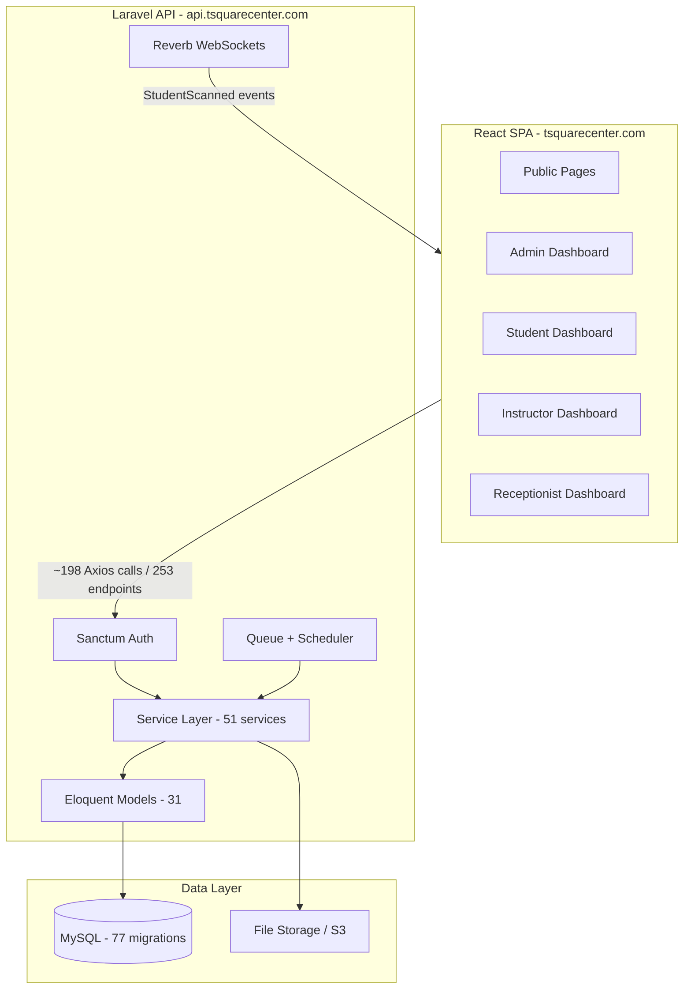

# T-Square LMS — Professional CV Entry Guide (Full-Stack, English)

## Project Identity

| Field                     | Value                                                                                                                                                |
| ------------------------- | ---------------------------------------------------------------------------------------------------------------------------------------------------- |
| **Project Name**          | T-Square LMS (Learning Management System)                                                                                                            |
| **Domain**                | Training-center LMS for in-person/hybrid courses                                                                                                     |
| **Live URLs**             | [tsquarecenter.com](https://tsquarecenter.com) · [api.tsquarecenter.com](https://api.tsquarecenter.com)                                              |
| **Your Role (suggested)** | Full-Stack Developer                                                                                                                                 |
| **Repos**                 | Backend: [T-square_back](https://github.com/Dolla464/T-square_back.git) · Frontend: [T-square_front](https://github.com/Dolla464/T-square_front.git) |
| **Backend path**          | [`D:\ADEL\Web Developing\tsquare project\t-square-lms`](D:\ADEL\Web Developing\tsquare project\t-square-lms)                                         |
| **Frontend path**         | [`D:\ADEL\T-square_front`](D:\ADEL\T-square_front)                                                                                                   |

---

## One-Line Summary (for CV header)

> Full-stack LMS for a training center — Laravel 13 REST API + React 19 SPA with role-based dashboards, exams, QR attendance, payments, certificates, and bilingual (AR/EN) support.

---

## Recommended CV Block (copy-paste)

### T-Square LMS — Full-Stack Developer

**T-Square Training Center** · [tsquarecenter.com](https://tsquarecenter.com) · _2024 – Present_

Designed and built an end-to-end Learning Management System for a real training center, serving **4 operational roles** (Admin, Instructor, Student, Receptionist) plus a public marketing site.

**Key deliverables:**

- Architected a **Laravel 13 / PHP 8.3** REST API with **253 endpoints**, **31 Eloquent models**, and **77 database migrations**, organized via Service Layer, Form Requests, API Resources, and domain observers.
- Built a **React 19 / Vite 8** SPA (~**56K LOC**, **142 components**, **~198 API integrations**) with lazy-loaded routes, Context-based auth, and role-protected dashboards.
- Implemented **bilingual Arabic/English UI** with full **RTL** support (i18next, 24 translation namespaces, Bootstrap RTL, Cairo font).
- Delivered **QR-based attendance** with real-time updates (Laravel Reverb WebSockets on backend; polling/live sessions on frontend).
- Built a **timed exam engine** — question banks, randomized attempts, group activation, attempt review, and PDF result exports.
- Implemented **chunked video upload** (Uppy + SHA-256 worker on frontend; state-machine upload service on backend).
- Added **order/payment workflow**, enrollment automation, certificate generation, admin analytics (Chart.js), and Arabic-aware PDF exports (DomPDF + ar-php).
- Set up **CI/CD pipelines** (GitHub Actions → aaPanel production deploy) for both frontend and backend.
- Wrote **104 automated tests** (Pest/PHPUnit) covering core API flows.

**Tech stack:** Laravel 13, PHP 8.3, MySQL, Sanctum, Spatie Permission, Reverb, DomPDF, Pest · React 19, Vite, React Router 7, Axios, Bootstrap 5, i18next, Chart.js, Uppy, Zod, Vitest · Docker, PM2, GitHub Actions

---

## Verified Metrics (use these numbers)

### Combined project scale

| Metric                 |                       Backend |                          Frontend |            **Total / Combined** |
| ---------------------- | ----------------------------: | --------------------------------: | ------------------------------: |
| Lines of code          |                   ~31,078 PHP |                ~55,700 (JS + CSS) |                 **~87,000 LOC** |
| Source files           |           ~795 (excl. vendor) |                     521 in `src/` |               **~1,300+ files** |
| API endpoints          |                       **253** |                                 — |          **253 REST endpoints** |
| API call sites (Axios) |                             — |                          **~198** |    **~198 client integrations** |
| Database models        |                        **31** |                                 — |                   **31 models** |
| Migrations             |                        **77** |                                 — |               **77 migrations** |
| Automated tests        | **104 test cases** (23 files) |                       1 test file |          **104+ backend tests** |
| User roles             |        **4** (+ guest public) |                   **4** (+ guest) |         **4 operational roles** |
| Routes/pages           |              262 total routes |              ~58 navigable routes |         **Full-stack coverage** |
| React components       |                             — |                 **142 JSX files** |              **142 components** |
| Custom hooks           |                             — |                            **61** |                    **61 hooks** |
| Service classes        |                        **51** |          **46 API service files** |          **97 service modules** |
| Controllers            |                        **53** |                                 — |              **53 controllers** |
| i18n namespaces        |            PDF Arabic support |       **24 namespaces × 2 langs** |             **Bilingual AR/EN** |
| Form validation        |          **35 Form Requests** |             Zod + React Hook Form |           End-to-end validation |
| Notifications          |   **11 notification classes** |              Toast + polling (4s) |                    Real-time UX |
| Scheduled jobs         |        **8 Artisan commands** |                                 — | Automated attendance/scheduling |
| CI/CD                  |        Laravel GitHub Actions | React GitHub Actions + Lighthouse |              **Dual pipelines** |

### HTTP method breakdown (backend)

- GET: 156 · POST: 55 · DELETE: 24 · PUT: 8 · PATCH: 5

### Feature module route counts (backend)

- Admin: 115 · Receptionist: 50 · Instructor: 37 · Student: 25 · Exams: 6 · Auth/Public: ~20

---

## Impact-Oriented Bullet Points (pick 4–6)

Use these as interchangeable bullets — each starts with a strong verb and includes a metric:

1. **Architected** a production LMS spanning **~87K LOC** across Laravel and React, powering a live training-center platform at **tsquarecenter.com**.
2. **Built 253 REST API endpoints** with role-based access (Spatie Permission) for admin, instructor, student, and receptionist workflows.
3. **Developed 142 React components** and **61 custom hooks** across **4 role-specific dashboards** and a public marketing site.
4. **Implemented QR attendance system** with hardware device auth, session scheduling, and **real-time WebSocket broadcasts** via Laravel Reverb.
5. **Engineered exam module** with randomized question sampling, timed attempts, group-level activation, and PDF export with **Arabic glyph shaping** (ar-php).
6. **Delivered bilingual AR/EN experience** with **48 locale files**, RTL layout switching, and Arabic-first SEO metadata.
7. **Built chunked video upload pipeline** using Uppy + SHA-256 Web Worker (frontend) and upload state machine (backend) for large course media.
8. **Automated operations** via **8 scheduled commands** (attendance activation, weekly session generation, upload cleanup).
9. **Achieved 104 automated API tests** with Pest, covering enrollment, exams, payments, and attendance flows.
10. **Deployed via CI/CD** — GitHub Actions builds, lints, and deploys to aaPanel production with Lighthouse performance checks.

---

## Architecture (for interviews / portfolio)



---

## Core Features to Mention (grouped by domain)

| Domain          | What you built                                                                           |
| --------------- | ---------------------------------------------------------------------------------------- |
| **Catalog**     | Course CRUD, categories, tags, instructors, reviews, public discovery                    |
| **Enrollment**  | Learning groups (cohorts), branches, bulk assign/complete, student enrollment            |
| **Scheduling**  | Weekly session generation, branch schedules, PDF schedule exports                        |
| **Attendance**  | QR check-in, hardware scanner devices, manual marking, live session polling              |
| **Exams**       | Question banks, rich-content questions, randomized attempts, group activation, review UI |
| **Commerce**    | Orders/payments (admin-recorded), revenue dashboard, enrollment on payment               |
| **Credentials** | Certificate generation, view/download                                                    |
| **Media**       | Chunked video upload, duration extraction (getID3), course previews                      |
| **Operations**  | Admin analytics, maintenance mode, contact messages, notifications                       |
| **Docs**        | Auto-generated OpenAPI via Scramble (`/docs/api`)                                        |

---

## Skills Section (keywords to add)

**Backend:** Laravel 13, PHP 8.3, REST API Design, Service Layer Architecture, Eloquent ORM, MySQL, Laravel Sanctum, Spatie Permission, Laravel Reverb, Queues, Scheduled Tasks, DomPDF, Pest/PHPUnit, OpenAPI/Scramble, Docker, PM2

**Frontend:** React 19, Vite 8, React Router 7, Axios, Bootstrap 5, i18next/RTL, React Hook Form, Zod, Chart.js, Uppy, Code Splitting, Vitest, ESLint, GitHub Actions

**Cross-cutting:** RBAC, Real-time Systems, PDF Generation (Arabic), CI/CD, aaPanel Deployment, LMS Domain

---

## What NOT to overclaim

- **Payments:** Internal order management (admin/receptionist recorded) — **not** Stripe/PayPal integration.
- **Backend README** is outdated (mentions Sanctum as "planned") — the codebase has full Sanctum + 253 endpoints implemented.
- **Frontend tests:** Only 1 component test file exists — lead with backend's **104 tests**, not "comprehensive test coverage."
- **PWA:** Manifest exists but **no service worker** — describe as "mobile-ready meta/manifest," not full PWA.
- **Multi-language DB:** Courses have a `language` field; full i18n is primarily on the **frontend** (48 JSON locale files).

---

## Optional Portfolio / LinkedIn Additions

**Project description (short):**

> T-Square LMS is a production full-stack platform for training centers. It combines a Laravel 13 API (253 endpoints, 31 models) with a React 19 bilingual SPA (AR/EN, RTL). Features include course management, cohort-based learning groups, QR attendance with real-time updates, timed exams, payments, certificates, and admin analytics.

**Tags:** `#FullStack` `#Laravel` `#React` `#LMS` `#RTL` `#Arabic` `#RESTAPI` `#WebSockets` `#CI/CD`

**Quantified headline for LinkedIn Featured section:**

> ~87K LOC · 253 API Endpoints · 142 React Components · 4 Role Dashboards · Live at tsquarecenter.com

---

## Suggested CV Layout

```
PROJECTS
─────────────────────────────────────────────────────────
T-Square LMS — Full-Stack Developer                    2024 – Present
tsquarecenter.com | Laravel 13 · React 19 · MySQL

[2-line summary from "One-Line Summary" above]

• [Pick 4–6 bullets from "Impact-Oriented Bullet Points"]
• Tech: Laravel 13, PHP 8.3, React 19, Vite, MySQL, Sanctum, Reverb, i18next
```

Keep total project entry to **6–8 lines** on a 1-page CV; move extra bullets to portfolio/GitHub README.
